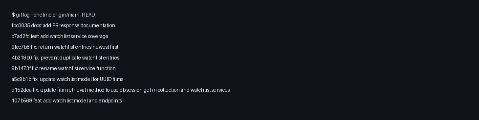

# PR Response

## AI Usage

I used AI as a helper for orientation and review hygiene: summarizing the existing `models.py`, `services/collection_service.py`, and `tests/test_collection.py` patterns; checking that the watchlist changes followed those patterns; and verifying that the final commit messages use conventional commit format. For the design responses, I used AI to surface tradeoffs and counterarguments, then kept the final decisions grounded in CineLog's codebase and product context.

## Review Comment 1: Rename `save_to_watchlist()`

The reviewer pointed out that `save_to_watchlist()` did not follow CineLog's existing service naming convention. I renamed it to `add_to_watchlist()` to match the `verb_to_noun` pattern used by `add_to_collection()` and `remove_from_collection()`.

I also updated the watchlist route import and call site so `POST /watchlist/<user_id>/add` now calls `add_to_watchlist()`.

## Review Comment 2: Prevent Duplicate Watchlist Entries

The original implementation allowed the same user and film pair to be saved multiple times. I added an `AlreadyInWatchlistError`, checked for an existing `WatchlistEntry` before creating a new one, and added a database-level unique constraint on `(user_id, film_id)` named `unique_user_film_watchlist`.

The route now catches `AlreadyInWatchlistError` and returns `409 Conflict`, matching the collection route's duplicate-handling pattern.

## Review Comment 3: Add a Nonexistent Film Test

I added `tests/test_watchlist.py`, following the fixture and assertion style from `tests/test_collection.py`. The new test `test_add_to_watchlist_nonexistent_film_raises()` uses a fake UUID and verifies that `add_to_watchlist()` raises `FilmNotFoundError` instead of creating an invalid entry or surfacing a database integrity error.

I also added watchlist tests for the happy path, duplicate handling, and sort order.

## Review Comment 4: Default Visibility Decision

I kept `public=True` as the default for watchlist entries. CineLog is framed as a community film tracking app, and public watchlists support the social discovery use case: friends can see what someone is interested in watching next without requiring extra setup from every user.

The tradeoff is privacy. A watchlist can reveal taste, intent, or future plans more directly than a watched collection. Because of that, I would want future product work to make the visibility state clear in the UI and eventually allow users to choose visibility explicitly when adding a film. For this PR, I kept the existing public default because the app currently has no visibility control flow, and changing the default silently to private would make the new feature less discoverable without solving the larger missing-control problem.

## Review Comment 5: Watchlist Sort Order

I changed the watchlist sort order from alphabetical title order to `date_added` descending. I agree with the reviewer that watchlists behave more like a queue of recent intent than a catalog browser. When a user opens their watchlist, the most useful first view is usually the film they just saved, not the alphabetically earliest title.

This also matches `get_collection()`, which returns the newest entries first. Keeping both collection and watchlist ordered by recency makes the API behavior easier to predict.

## Review Comment 6: Rebase on Updated `main`

I rebased `feature/watchlist` onto `origin/main` after fetching the updated branch. The rebase produced a conflict in `models.py` because `main` migrated `Film.id` and `CollectionEntry.film_id` from integer IDs to UUID strings, while the watchlist branch still introduced `WatchlistEntry.film_id` as an integer.

I resolved the conflict by keeping `main`'s UUID model state and updating `WatchlistEntry.film_id` to `db.String(36)` with `db.ForeignKey("film.id")`. I also updated the watchlist service docstring and route body docs to describe `film_id` as a UUID. After the conflict resolution, I reran the tests and confirmed the full suite passes.

## Verification

```bash
.venv/bin/python -m pytest tests -vv
```

Result: 8 tests passed.

## Git Log Screenshot



## PR Description

This PR adds a watchlist feature to CineLog so users can save films they want to watch later. It introduces a `WatchlistEntry` model, service-layer functions for adding and reading watchlist entries, and REST endpoints under `/watchlist`.

Design decisions:

- Watchlist entries default to `public=True` because CineLog is a community film tracking app and public watchlists support social discovery.
- Watchlists return newest entries first because they represent recent viewing intent, matching the existing `get_collection()` recency behavior.

Manual testing:

1. Create and activate a virtual environment.
2. Install dependencies with `pip install -r requirements.txt`.
3. Run the app with `python app.py`.
4. In a Python shell or setup script, create a `User` and `Film`, then copy their UUIDs.
5. Add a film to the user's watchlist:

```bash
curl -X POST http://127.0.0.1:5000/watchlist/<user_id>/add \
  -H "Content-Type: application/json" \
  -d '{"film_id":"<film_id>"}'
```

6. Confirm the watchlist returns the saved film:

```bash
curl http://127.0.0.1:5000/watchlist/<user_id>
```

7. Repeat the same `POST` and confirm the API returns `409 Conflict`.
8. Try a fake UUID for `film_id` and confirm the API returns `404 Not Found`.
9. Run `pytest tests/` and confirm all tests pass.
